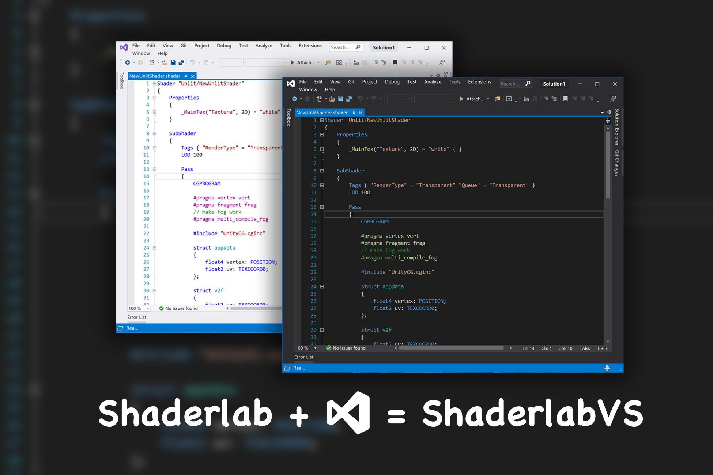
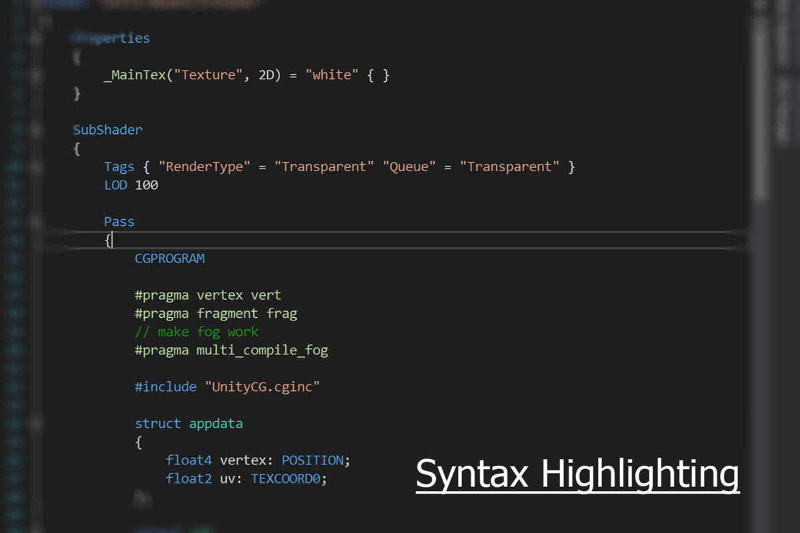
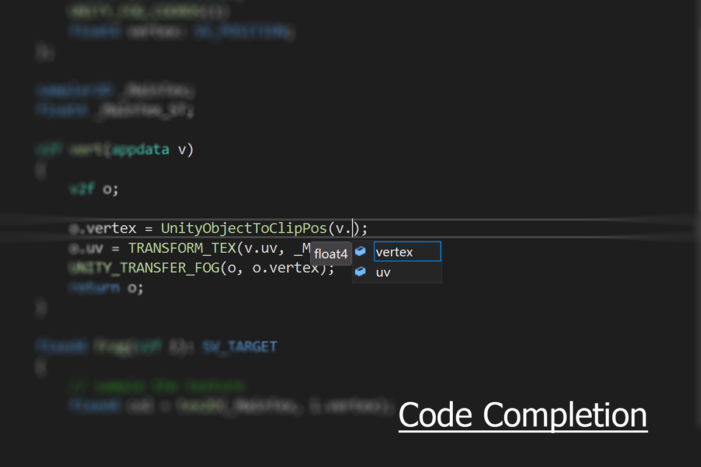
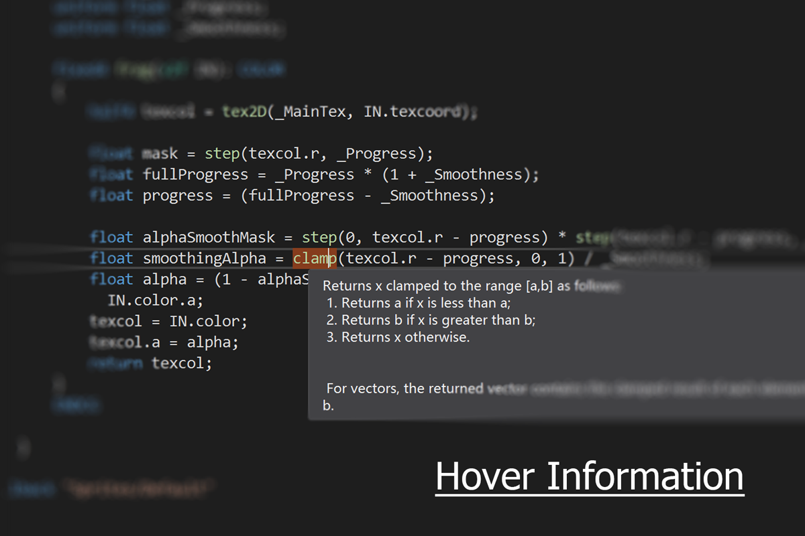
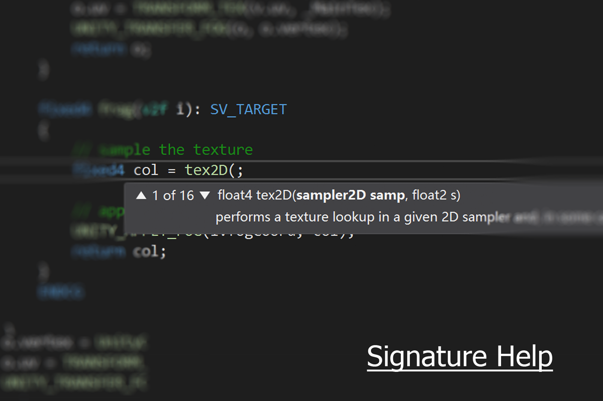
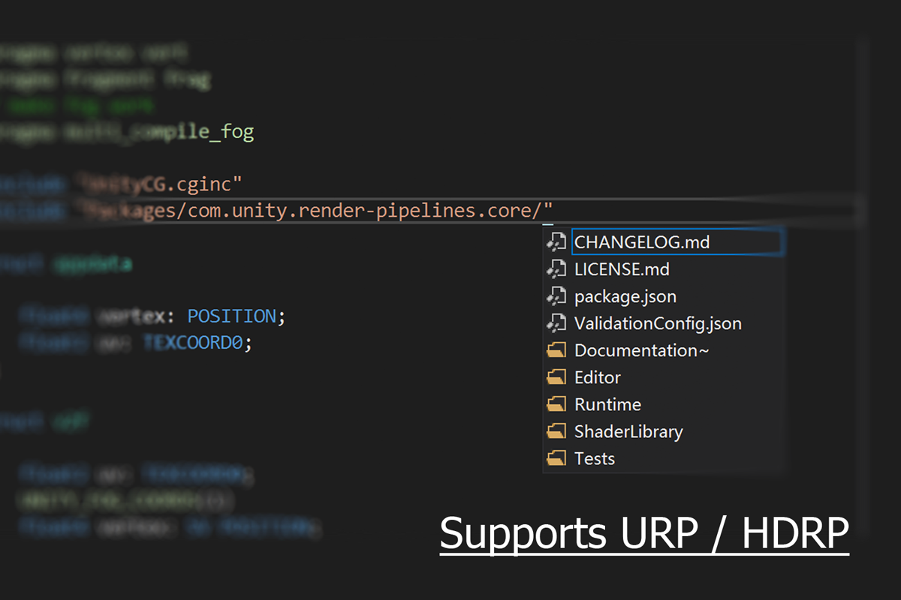
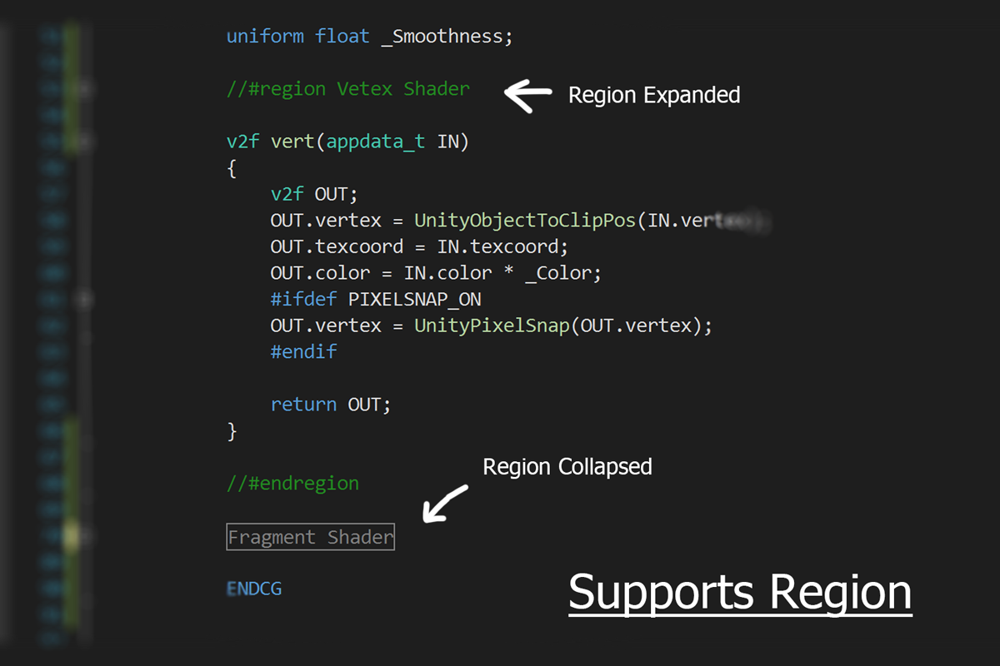
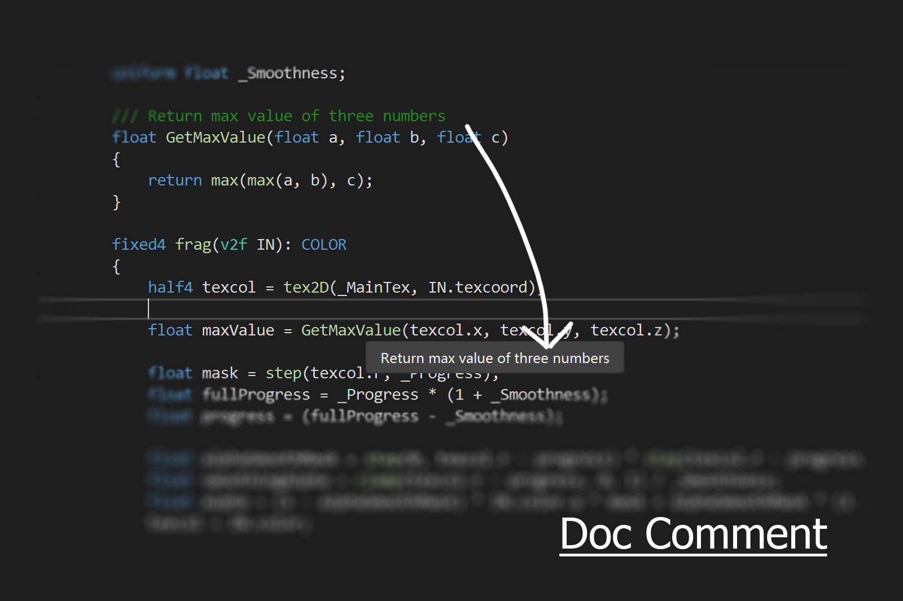
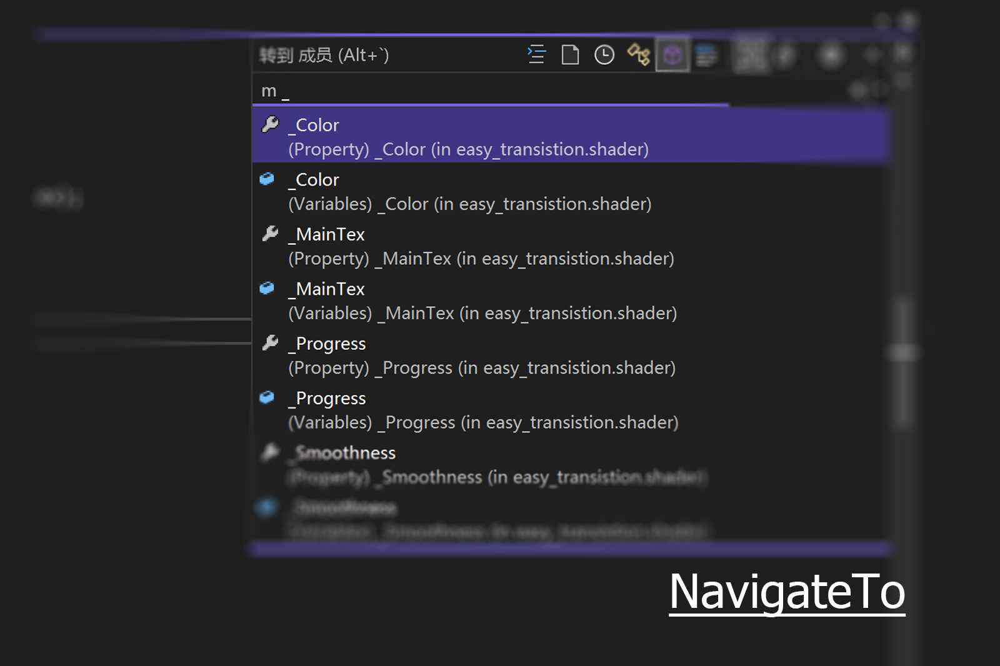

ShaderlabVS Pro
====

> ShaderlabVS will be upgraded to Omni Shader Tools For Unity, see more details on <https://omnishader.amlovey.com>
> 
> Users who purchased after June 1, 2024, can get a voucher code for a free license. See more details here: <https://github.com/OmniShader/ISSUES/issues/10>


ShaderlabVS Pro is a Visual Studio plugin for Unity shaderlab programming. It is paid version of [ShaderlabVS](https://github.com/wudixiaop/ShaderlabVS) which we made and open source since the year 2014. Compared with ShaderlabVS, it has more features and better performance.

<p>
<a href='http://forum.unity3d.com/threads/1032139/' target='_blank'><strong>Forum</strong> </a> &nbsp;|&nbsp; 
<a href='mailto:amlovey@qq.com'><strong>Email</strong></a> &nbsp;|&nbsp;
<a href='https://assetstore.unity.com/packages/slug/186176?aid=1011lGoJ' target='_blank'><strong>Purchase On Asset Store</strong> </a>  &nbsp;|&nbsp;
<a href='https://mbd.pub/o/bread/Zpubmpg=' target='_blank'><strong>Purchase On MianBaoDuo</strong></a>
</p>



<div style='position:relative;width:100%;height:0px;padding-bottom:62.52%'>
<iframe style="position: absolute;left:0;top:0;width:100%;height:100%" src="https://www.youtube.com/embed/EGK144QWbYo" frameborder="0" allowfullscreen></iframe>
</div>

## Installation

1. Get .vsxi file under path `Assets/ShaderlabVS/VSPlugin`
2. Double click the .vsxi file, a Visual Studio extension install window will pop up
3. Click `Install` button on install the window 
4. After install successfully, restart Visual Studio

## Support Visual Studio Version

-  Visual Studio 2019
-  Visual Studio 2022 

## Main Features

### Syntax Highlighting



### Code Completion



### Hover Information



### Signature Help



### Auto Format

#### Format Document

via menu `Editor -> Advanced -> Format Document` 

#### Format Selection

via Menu `Editor -> Advanced -> Format Selection`

#### Format On Save

Enable it by set **Tools** -> **Options** -> **Text Editors** -> **Shaderlab** -> **Formatting** -> **Auto Format On Save** to `true`

#### Place Open Brace On New Line

We can set brace formatting style in **Tools** -> **Options** -> **Text** **Editors** -> **Shaderlab** -> **Formatting** page.

If `Place Open Brace On New Line` is `true`, after formatting, open brace will be in new line, like below

```csharp
if (true)
{
  
}
```


if `Place Brace On New Line` is `fase`, after formatting, open brace will not in new line.

```csharp
if (true) {
  
}
```
#### Macros Alignment Modes

In Settings, there is an item under `ShaderlabVScode` section named `Formatting: Style`, change the `Macros alignment modes` to set formatting mode for macros.

##### Indentation with hierachy

```csharp
Subshader 
{
    Pass
    {
        CGPROGRAM
        void MacroTest()
        {
            float c;
            #if 0
                c = 0;
                #if 1
                    c = 1;
                #endif
            #endif
        }
        ENDCG
    }
}
```

##### Indentation without hierachy

```csharp
Subshader 
{
    Pass
    {
        CGPROGRAM
        void MacroTest()
        {
            float c;
         #if 0
                c = 0;
         #if 1
                c = 1;
         #endif
         #endif
        }
        ENDCG
    }
}
```

##### No Indentation but with hierachy

```csharp
Subshader 
{
    Pass
    {
        CGPROGRAM
        void MacroTest()
        {
            float c;
#if 0
            c = 0;
    #if 1
            c = 1;
    #endif
#endif
        }
        ENDCG
    }
}
```

##### No Indentation and without hierachy

```csharp
Subshader 
{
    Pass
    {
        CGPROGRAM
        void MacroTest()
        {
            float c;
#if 0
            c = 0;
#if 1
            c = 1;
#endif
#endif
        }
        ENDCG
    }
}
```


### Go To Definition


### Support SRP



### Code Snippets
Below are the snippets:

| Snippets     | Description                                           |
| ------------ | :---------------------------------------------------- |
| blend1-dc_1  | Blend OneMinusDstColor One                            |
| blend1_1-sa  | Blend One OneMinusSrcAlpha                            |
| blend1_1     | Blend One One                                         |
| blenddc_0    | Blend DstColor Zero                                   |
| blenddc_sc   | Blend DstColor SrcColor                               |
| blendsa_1-sa | Blend SrcAlpha OneMinusSrcAlpha                       |
| cgp          | CGPROGRAM...ENCG                                      |
| for          | `for` loop                                            |
| forr         | Reverse `for` loop                                    |
| glp          | GLSLPROGRAM...ENCGLSL                                 |
| hlp          | HLSLPROGRAM...ENDHLSL                                 |
| if           | if { ... }                                            |
| ifelse       | if {...} else {...}                                   |
| inc          | #include ""                                           |
| incpkg       | #include "Packages"                                   |
| incucg       | #include "UnityCG.cginc"                              |
| prop2d       | `2D` type property                                    |
| propc        | `Color` type property                                 |
| propcube     | `Cube` type property                                  |
| propf        | `Float` type property                                 |
| proprange    | `Range` type proprety                                 |
| props        | Properties { ... }                                    |
| propv        | `Vector` type property                                |
| shader       | Shader { ... }                                        |
| struct       | struct { ... };                                       |
| subshader    | SubShader { ... }                                     |
| tags         | Tags { ... }                                          |
| tagtt        | Tags with both of RenderType and Queue is Transparent |

### Regions

We can add region like C# to code using one of below the pairs:

* `//region` and `//endregion`
* `//#region` and `//#endregion`



### Script Templates

We can add customize script template and create them via menu `Create -> Shader -> [Customize Name]`. Install/update them to Unity by the menu `Tools -> ShaderlabVS Pro -> Install Script Templates` and Restart Unity is required. 

The template file format is `[Menu Name]-[Default File Name].txt` , for example `HLSL Shader-New HLSL Shader.hlsl.txt` means using `Create -> Shader -> HLSL Shader` menu to create a file default named to `New HLSL Shader.hlsl`.

### Doc Comment

Doc comment is the comment starts with `///`



### Navigate To

`Ctrl + ,` to open NavigateTo window


